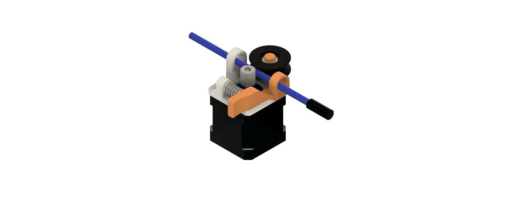

# V2.1

Cette version du robot a méné à la conception d'un système d'extrusion du câble d'un boroscope. Le mécanisme est inspiré des systèmes d'extrusion de filament des imprimantes 3D. 

## Montage final de l'extrudeuse

## Modèles 3D

| Nom          | Image     | 
|--------------|-----------|
| Extrudeuse Axe Roulement |  |
| Extrudeuse Base |  |
| Poulie |  |
