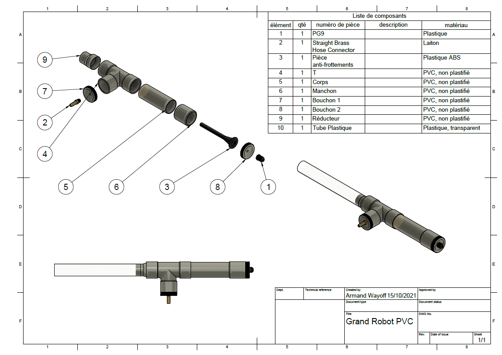

# En cours de conception...

# Présentation du projet
# Conception du robot

### Objectif
Déployer le corps du robot et contrôler sa vitesse d'extrusion

| Longueur | 3m      |
| Diamètre | 50mm    |
| Débit du compresseur  | 25L/min |
| Pression dans le tube | 1,5atm  |

## V2.2

# Documents
📃[Compte rendu](https://www.overleaf.com/read/gymmdvhcswqz)

🗨 [Présentation orale](https://www.overleaf.com/read/zycrhdjdwmsb)
